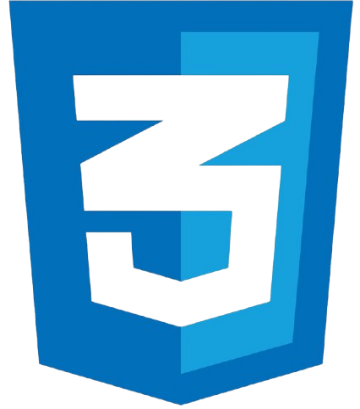
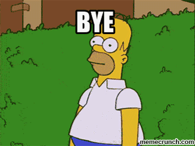

<svg width="100%" height="100">
  <defs>
    <linearGradient id="gradiente" x1="0%" y1="0%" x2="100%" y2="0%">
      <stop offset="0%" style="stop-color:#833AB4; stop-opacity:1" />
      <stop offset="50%" style="stop-color:#FD1D1D; stop-opacity:1" />
      <stop offset="100%" style="stop-color:#FCB045; stop-opacity:1" />
    </linearGradient>
  </defs>
  <text x="50%" y="50%" font-size="38" font-weight="bold" text-anchor="middle" fill="url(#gradiente)" dy=".3em">
    ✨Pagina Instagram✨
  </text>
</svg>

    

     
    

<h4 align="center"> 🧠 Esse projeto foi criado no intuito de praticar meus conhecimentos em HTML5 e CSS3.</h4>
 

 

        <h3>✨ Técnologias Usadas para a criação do site ✨</h3>
        
        
        <h3>✨ Site usado para banco de icones ✨</h3>
        

[Link para o site](https://fontawesome.com/icons)

<h1 style="background: linear-gradient(45deg, #833AB4, #FD1D1D, #FCB045);
    -webkit-background-clip: text;
    -webkit-text-fill-color: transparent;
    font-weight: bold;" align="center">
Muito obrigado por visitar o meu perfil
</h1>
 

